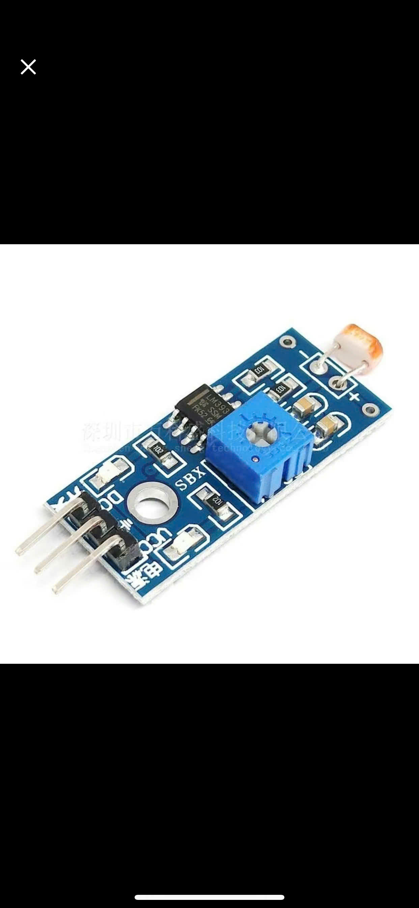
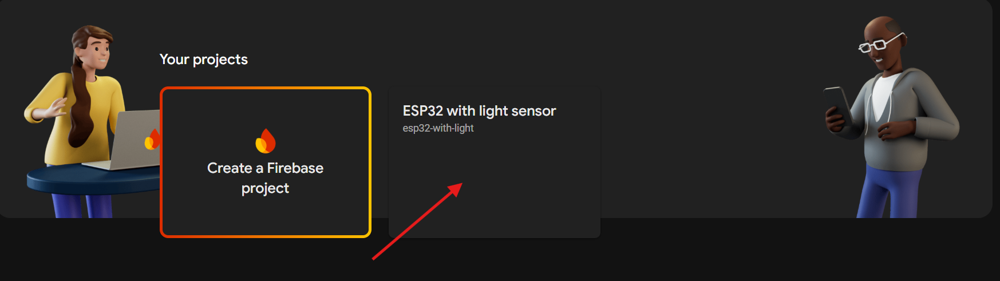
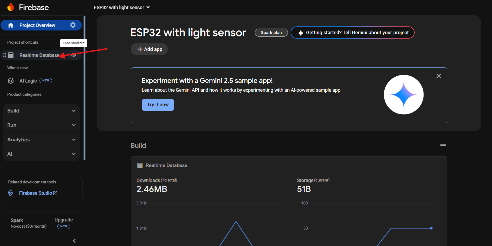
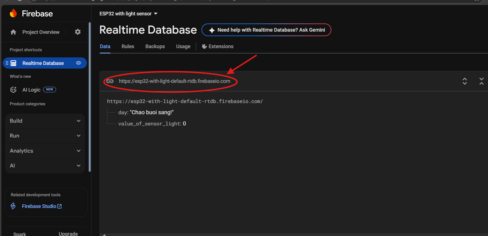
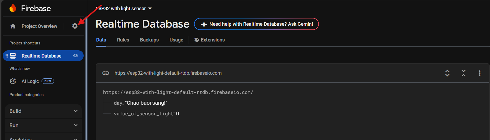

# ESP-Firebase-Web-App - LÊ NGỌC TUẤN

# A. Công việc đã làm
## 1. Đọc giá trị cảm biến ánh sáng và điều khiển led

###  Cách hoạt động của cảm biến ánh sáng?
- Cảm biến ánh sáng nhận tín hiệu ánh sáng làm điều kiện 
### Cảm biến ánh sáng có mấy kiểu trả về?
- Cảm biến ánh sáng có 2 kiểu trả về là digital(0 và 1) và analog( từ 0 -> 4095) 
### Code đọc giá trị cảm biến ánh sáng 
	
	int value_of_light = digitalRead(D0); // D0 là chân nhận tín hiệu từ cảm biến
### Code điều khiển led bằng cảm biến ánh sàng
	
	digitalWrite(Led, value_of_light); // Led là chân nhận tín hiệu từ esp của led
## 2. Thiết lập Firebase-Web-App với esp32
### a. Kết nối wifi
- Định dạng tên wifi, password?
	
		const char* ssid = "ten_mang";
		const char* password = "mat_khau_mang";
- Thiết lập kết nối Wifi cho esp32

		WiFi.begin(ssid, password);
		while(WiFi.status() != WL_CONNECTED){
			delay(500);
			Serial.print(".");
		}
		Serial.println("");
		Serial.println("Wifi connected!");
### b. Thiết lập Firebase
- Khai báo đối tượng toàn cục là gì?, Tìm hiểu 3 đối tượng dưới?
	
		FirebaseData fbData;
		FirebaseAuth auth;
		FirebaseConfig config;

- Hàm thiết kết nối esp với Firebase
	
		 config.host = Firebase_Host ;
		 config.signer.tokens.legacy_token = Firebase_Auth;
		 Firebase.begin(&config, &auth);
		 Firebase.reconnectWiFi(true);
	
- Định dạng host, auth?

		define Firebase_Host  "esp32-with-light-default-rtdb.firebaseio.com/" | -> lấy ở link địa chỉ Realtime Database
		define Firebase_Auth  "ex4GKoswbBLYjc0rtc4bWe5iZ5DZb9JBqkhI3F8Q" | -> project setting -> service accounts -> Database secrets
- Cách lấy link Host:
	
	

+ Bước 1: 

+ Bước 2:

+ Bước 3:

+ Bước 4:

+ lưu ý bỏ phần "http://"
		
- Cách lấy link Auth 

	

+ Bước 1:

+ Bước 2:

+ Bước 3:

+ Bước 4:

+ Bước 5:	

- Có thể sử dụng email thay cho auth?
	
		config.api_key = "YOUR_API_KEY";
		auth.user.email = "your@email.com";
		auth.user.password = "yourpassword";

## 3. Cập nhật giá trị cảm biến lên Firebase
		
		void get_to_firebase_from_esp(int value)
		{
		   Firebase.setInt(fbData, name_int, value);
		   if(value == 0) Firebase.setString(fbData,name_day, "Chao buoi sang!");
		   else Firebase.setString(fbData,name_day, "Chao buoi toi!");
			
		  Serial.println("Push data to /esp done !");
		   delay(500);
		 }
		 
## 4. Các lỗi có thể gặp phải khi thiết lập wifi và kết nối Firebase

### a. wifi
- Sai tên(ssid)
- Sai mật khẩu (password)
### b. Firebase
- Sai khi khai báo toàn cục
- Thư viện đổi mới, không cập nhập cú pháp liên kết 
- Tìm hiểu lỗi từ "FirebaseConfig" là gì?
## 5. Các thư viện cần dùng 
	
	#include<WiFi.h> // thiết lập wifi cho esp32
	#include<FirebaseESP32.h> // thiết lập kết nội esp32 vs Firebase
	#include <Adafruit_ST7735.h> // màn hình hiển thị oled

# B. Công việc tiếp theo 

### Điều khiển Led bằng Firebase Web 