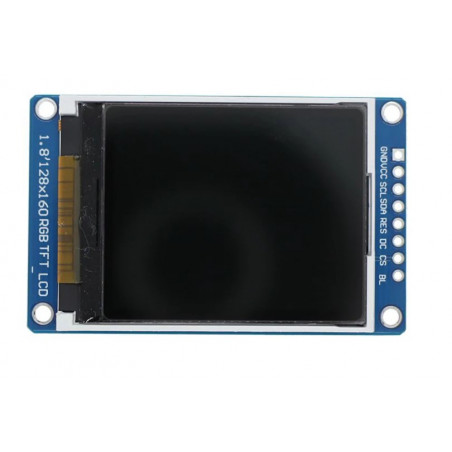
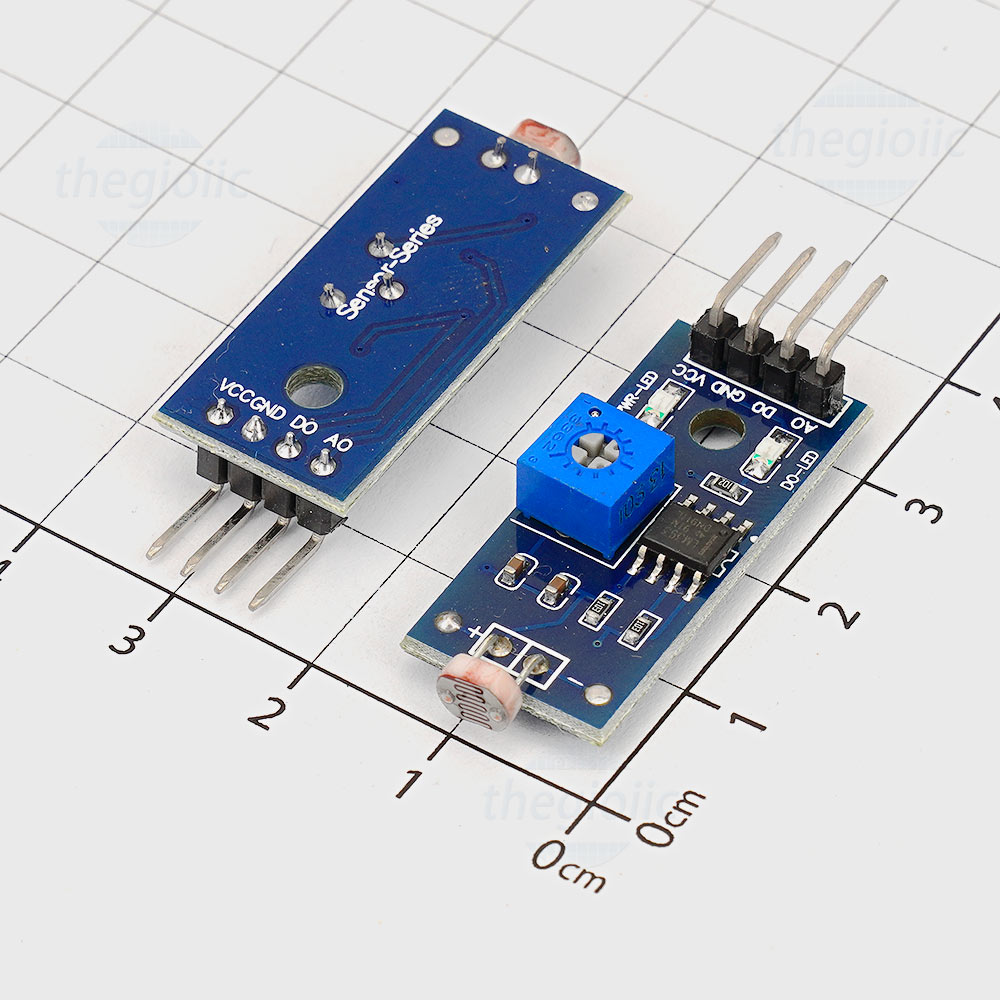
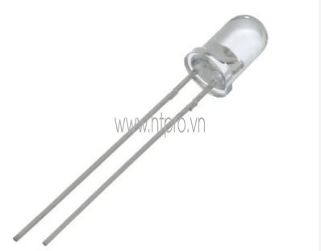
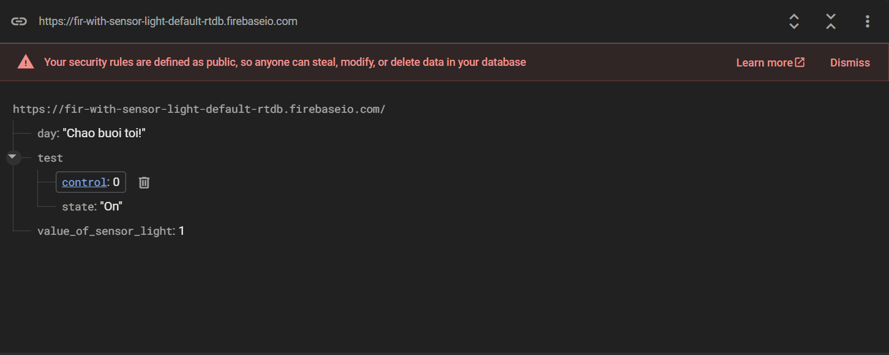

# ESP-Firebase-Web-App - LÊ NGỌC TUẤN

Đề tài 3: Đọc cảm biến ánh sáng để điều khiển bật tắt led (cập nhật giá trị lên Firebase),
điều khiển led bằng Firebase web

# A. Công việc đã làm 

## 1. Video demo: https://youtube.com/shorts/ilBtpRJlL7w?feature=share
## 2. Sơ đồ khối và nguyên lý hoạt động
### a. Sơ đồ khối

### b. Nguyên lý hoạt động
- Module cảm biến ánh sáng: Chuyển cường độ ánh sáng thành tín hiệu điện tương ứng dựa 
trên hiệu ứng quang điện, quang dẫn hoặc sự tháy đổi điện trở
- Esp32: Kết nối với Wifi để nhận và gửi dữ liệu từ esp lên firebase và ngược lại
- Màn Oled: hiện thị các thông tin cơ bản mà mình muốn
- Led: nhận tín hiệu từ esp và tín hiệu từ module cảm biến ánh sáng làm điều kiện bật và tắt led

## 3. Sơ đồ chân 
ESP32	| Cảm biến ánh sáng | OLED  |  LED 	| 
--------|-------------------|-------|-------|
G21		|		D0			|		|		|
GND		|		GND			|	GND	|	-	|
3v3		|		VCC			|	VDD	|		|
G18		|					|	SCL	|		|
G23		|					|	SDA	|		|
G4		|					|	RST	|		|
G2		|					|	DC	|		|
G5		|					|	CS	|		|
3v3		|					|	BLK	|		|
G26		|					|		|	+	|

## 4. Linh kiện cần dùng 
- Esp32 38 chân 

- Oled TFT 1.8 inch, kich thước: 128x160

- Cảm biến ánh sáng chip LM393

- Led + trở 220ohm

- Dây cắm
- Board cắm 
## 4. Tính năng
- Đọc giá trị cảm biến ánh sáng
- Điều khiển led bằng cảm biến ánh sáng
- Gửi dữ liệu từ esp32 lên Firebase
- Hiện thị lên màn Oled
- Điều khiển led bằng Realtime Database
- Điều khiển led bằng cả firebase và cảm biến ánh sáng 

## 5. Code
### a. Kết nối Firebase, Wifi với esp
- File "Firebase.cpp" dùng để kết nối Esp32 với Firebase
- File "firebase_esp.cpp" dùng để tạo các hàm liên quan đến firebase gồm đọc data từ firebase, điều khiển led từ firebase, đẩy data từ esp lên firebase
- File "Wifi.cpp" dùng để kết nối esp32 với wifi 
- File "firebase.h" dùng để khai báo hàm và biến cần dùng cho esp và firebase 
### b. Điều khiển led
- File "light.cpp" đọc cảm biến ánh sáng, điều khiển led bằng tín hiệu từ cảm biến ánh sáng và kiểm tra trạng thái của led
- File "light.h" khai báo hàm và biến sử dụng cho file"light.cpp"
### c. Khai báo chân
- File "pin.cpp" khai báo chân các linh kiện kết nối với Esp32
- File "pin.h" khai báo hàm và biến 
### d. Hiển thị data lên màn oled tft
- File "tft.cpp" Khởi tạo các hàm khởi tạo màn hiện thị Oled, hiển thị trạng thái của thiết bị, hàm xóa trên oled
- File "tft.h" khai báo hàm và biến

# B. Mô tả sản phẩm
- Dự án hoạt động bao gồm 1 trang Firebase hoạt động online và esp32 đã liên kết vs Firebase và Wifi.
- Trong Firebase có các từ điều khiển như hình bên dưới: 

+ "day": hiển thị ban ngày hay ban đêm dựa vào led bật hay tắt. Led bật -> "buổi tối", Led tắt -> "buổi sáng"
+ " test/control" điều khiển led
+ "test/state" : điều khiển cách hoạt động của cảm biến ánh sáng. Nếu state = "On" thì bật cảm biến ánh sáng, state "Off" thì cảm biến ánh sáng tắt
+ "value_of_sensor_light" giá trị trả về của cảm biến ánh sáng khi state = "On" 	
	