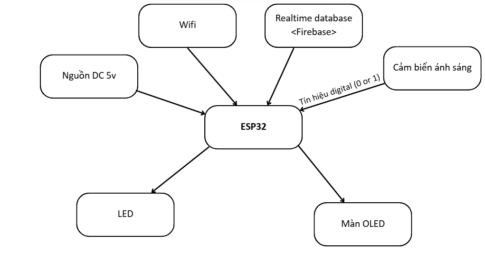

# ESP-Firebase-Web-App - LÊ NGỌC TUẤN

Đề tài 3: Đọc cảm biến ánh sáng để điều khiển bật tắt led (cập nhật giá trị lên Firebase),
điều khiển led bằng Firebase web

# A. Công việc đã làm 

## 0. Video demo: https://youtube.com/shorts/ilBtpRJlL7w?feature=share
## 1. Sơ đồ khối và nguyên lý hoạt động
### a. Sơ đồ khối

### b. Nguyên lý hoạt động
- Module cảm biến ánh sáng: Chuyển cường độ ánh sáng thành tín hiệu điện tương ứng dựa 
trên hiệu ứng quang điện, quang dẫn hoặc sự tháy đổi điện trở
- Esp32: Kết nối với Wifi để nhận và gửi dữ liệu từ esp lên firebase và ngược lại
- Màn Oled: hiện thị các thông tin cơ bản mà mình muốn
- Led: nhận tín hiệu từ esp và tín hiệu từ module cảm biến ánh sáng làm điều kiện bật và tắt led

## 2. Sơ đồ chân 
ESP32	| Cảm biến ánh sáng | OLED  |  LED 	| 
--------|-------------------|-------|-------|
G21		|		D0			|		|		|
GND		|		GND			|	GND	|	-	|
3v3		|		VCC			|	VDD	|		|
G18		|					|	SCL	|		|
G23		|					|	SDA	|		|
G4		|					|	RST	|		|
G2		|					|	DC	|		|
G5		|					|	CS	|		|
3v3		|					|	BLK	|		|
G26		|					|		|	+	|

## 3. Tính năng
- Đọc giá trị cảm biến ánh sáng
- Điều khiển led bằng cảm biến ánh sáng
- Gửi dữ liệu từ esp32 lên Firebase
- Hiện thị lên màn Oled
- Điều khiển led bằng Realtime Database
- Điều khiển led bằng cả firebase và cảm biến ánh sáng 

## 4. Code
- Các file phía trên

